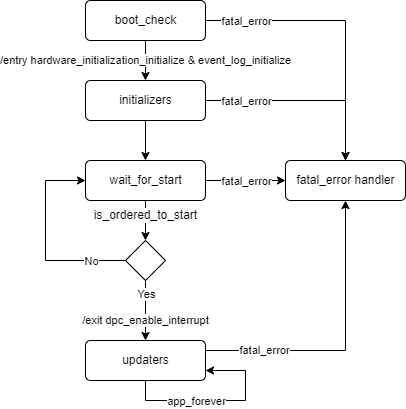

Application FSM
===============

The application fsm module exposes the application states.

States
------

The application can be divided into five states managing sub-tasks:

- Hardware initalization
  - Watchdog initialization
  - Pin mapping configuration
- Logging initilization
  - Event log initialization
- Boot check
  - Watchdog maintainer
  - Boot-check part
- Application initialization
  - Watchdog maintainer
  - Init Task Sequencer (Specific application initialization part)
  - Sync core initialization part
  - Fatal Error checker (master only)
- Application update
  - Watchdog maintainer
  - Periodic Task Sequencer (Specific application part)
  - Fatal Error checker (master only)

Requirements
------------

.. list2need:: 
    :types: srs
    :tags: su, swc, app_fsm
    :list-options:
        :hide:
    
    * (SU-SRS-APPFSM-00010) FSM Hardware Initialization.
    The app fsm shall initialize the hardware initialization module before anything else.
    * (SU-SRS-APPFSM-00020) FSM Post Hardware Initialization.
    When all cores are initialized, the app fsm shall post initialize the hardware.
    * (SU-SRS-APPFSM-00030) FSM Event Log Initialization.
    The app fsm shall initialize the event log module before its main loop.
    * (SU-SRS-APPFSM-00040) FSM Boot Status Handling.
    The app fsm shall provide a unified way to handle the boot statuses.
    * (SU-SRS-APPFSM-00050) FSM Fatal Error Handling.
    The app fsm shall provide a unified way to handle fatal error.
    * (SU-SRS-APPFSM-00060) FSM Synchronized Starting Sequence.
    The app fsm shall provide a unified way to synchronized starting sequence.
    * (SU-SRS-APPFSM-00070) FSM Periodic Task Management.
    The app fsm shall provide a unified way to manage periodic task sequence.

.. needtable::
    :filter: type == 'srs' and 'su' in tags and 'swc' in tags and 'app_fsm' in tags
    :style: table
    :columns: id;title as "Label";content as "Description"; outgoing as "Uplink(s)"
    :colwidths: 10,12,64,10
