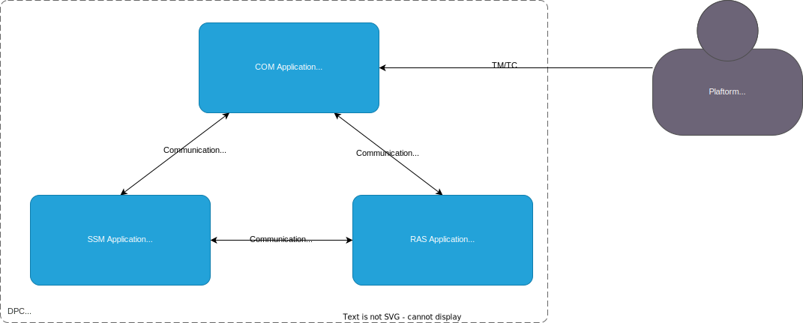

System Overview
===============

The system relies on the 3-cores architecture of the DPC micro-controller. The application is split on these 3 cores, communicating each-other through dedicated mailboxes that ensure a proper and safe way to exchange data between cores.

For more information about the communication mechanism between cores in the ``TODO`` section

All the cores, even if based of the same CPU architecture (MSP430) are not symmetrical due to their attached peripherals (and their allocated resources like DATA and CODE memory). These cores (and their peripherals) are designed to specific purposes:

* COM core (Communication Operation Management): destined to handle communication tasks
* SSM core (SubSystem Management): destined to handle state-machines and operation handlers
* RAS core (Regulation Arithmetic Sequencer): destined to handle Regulation and "real-time" tasks

These 3 cores have their own application loaded at the same time during the MCU boot.

   System Architecture Overview

