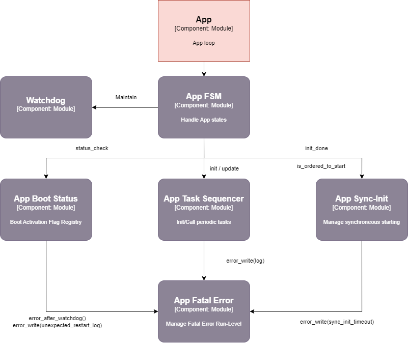

Software Components (SWC) Requirements
######################################

Introduction
============

The application module exposes a common application entry point *app_loop()*
 for all cores.

   
   App Module

This common interface will use common modules :

- App Boot Status to manage abnormal reboot sequence
- Watchdog to refresh the alive counter
- App Sync Init to sync multi-core boot sequence
- App Task Sequencer to handle periodic task sequence
- Fatal Error to enter in the fatal error state

The user of the module has only to registry the init functions and working functions
 to the app task sequencer, all other aspects are managed behind the scene.

Two kinds of core are considered:

- The master core :
  - Can reboot the platform
  - Order the synchronized start of each cores
- The other core can't reboot the platform and wait for the COM to start.

Run-levels
==========

The application can be divided into four states managing sub-tasks:

- Boot check (watchdog / unexpected reboot)
  - Watchdog maintainer
  - Boot-check part
- Initialization part
  - Watchdog maintainer
  - Init Task Sequencer (Specific app initialization part)
  - Sync core initialization part
  - Fatal Error checker (master only)
- Application part
  - Watchdog maintainer
  - Periodic Task Sequencer (Specific application part)
  - Fatal Error checker (master only)
- Fatal Error part
  - Fatal Error for Slave Core :
    - On watchdog error, signal watchdog error to master core and wait
      for general reboot.
    - On other error, signal error to master core and wait for watchdog reset
  - Fatal Error for Master Core :
    - On any local error, try to output the error and reboot platform.
    - On received error, read received error, try to output the error and
      reboot platform.

The sync initialization part implementation will differ depending whether
we are present in the master core or a slave core.

The initialization and application part implementation will differ depending
on the specific application aspects (Task Sequencer registry).

The Fatal Error checker is only implemented in the master core.

.. toctree::
    :maxdepth: 1
  
    common_cores/srs.common_cores.rst
    com_app/srs.com_app.rst

   

